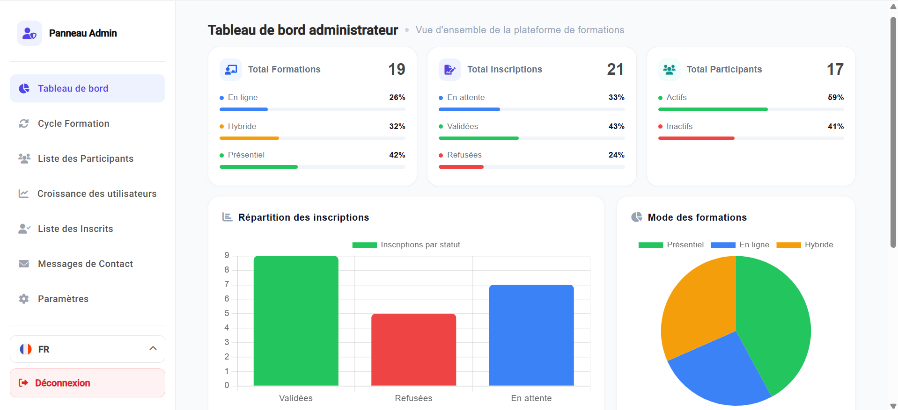
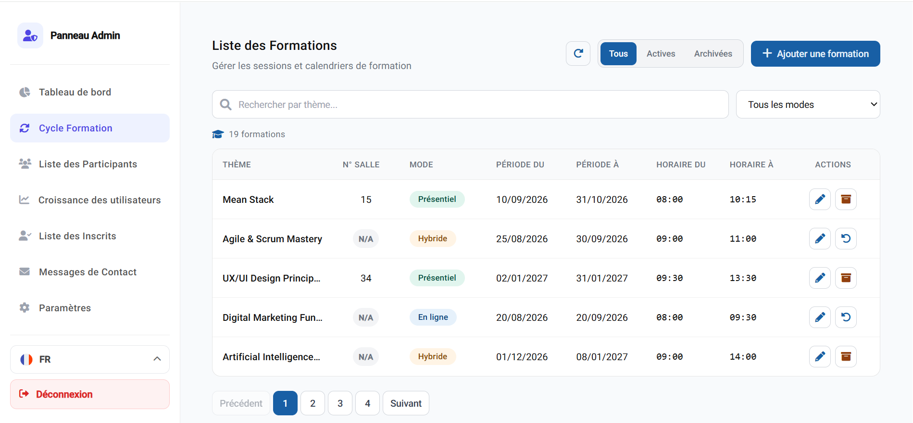
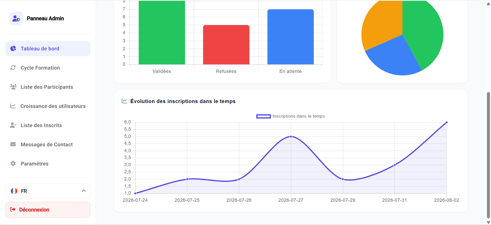
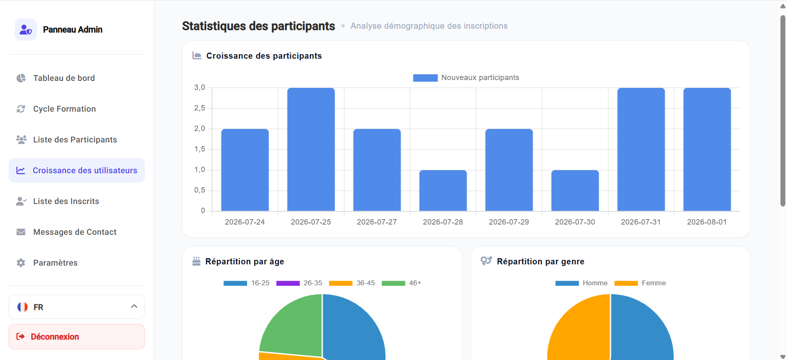
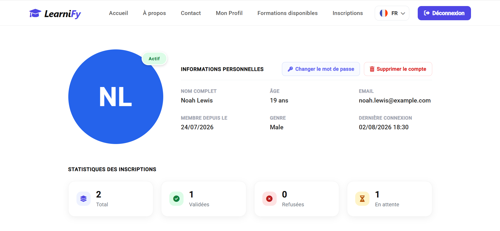
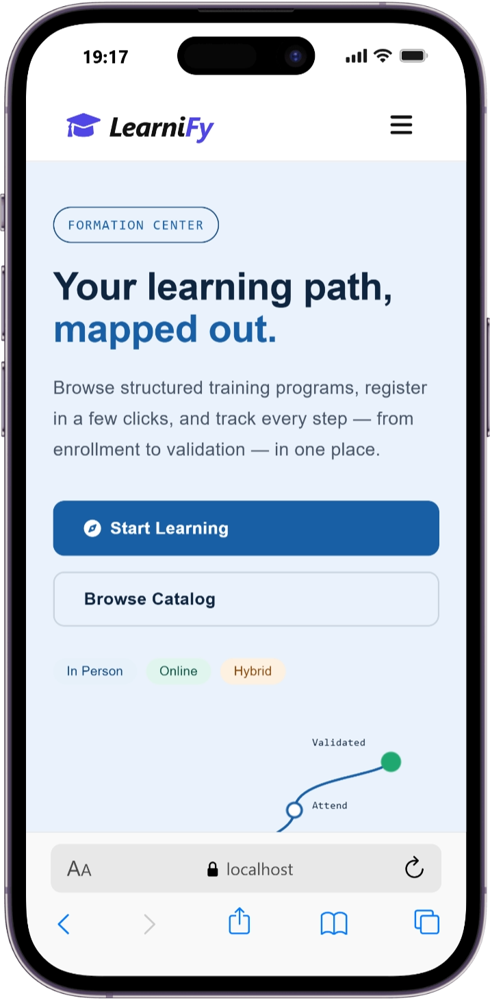
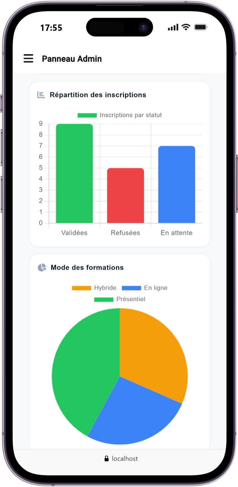
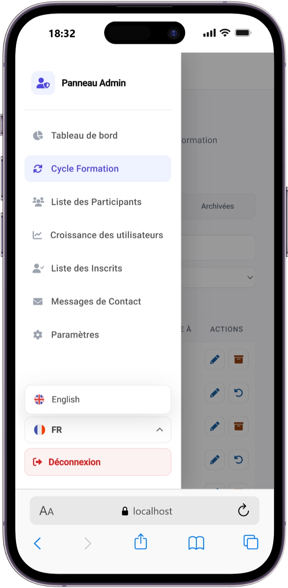
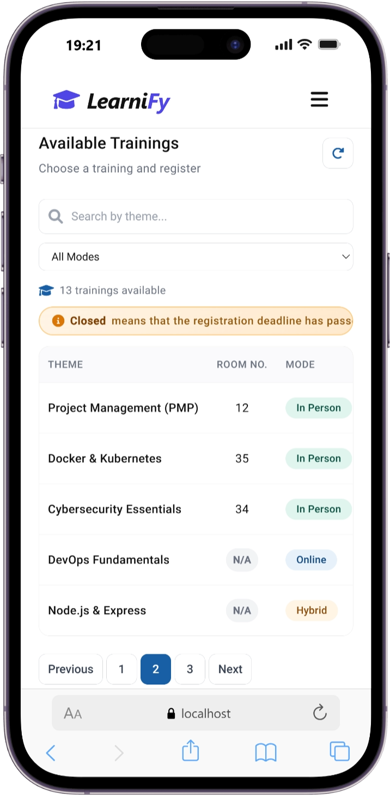

# Training Management Platform

A fully responsive web application for managing training cycles, registrations, participants, and analytics, with a full admin back-office.

## 🖼️ Preview

A quick look at the app.







<table>
  <tr>
    <td></td>
    <td></td>
    <td></td>
  </tr>
  <tr>
    <td></td>
    <td></td>
    <td></td>
  </tr>
</table>

## 🛠️ Tech Stack

**Frontend**
- Angular 16
- Angular Material (UI components)
- Angular Reactive Forms
- Chart.js / ng2-charts (data visualization)
- ngx-translate (English/French internationalization)
- SweetAlert2 (alerts and confirmations)
- Font Awesome (icons)

**Backend**
- Node.js 18 (Express.js)
- MongoDB with Mongoose
- JWT (authentication)
- bcrypt (password hashing)
- Multer (image uploads)
- Nodemailer (welcome emails)
- dotenv (environment variable management)

## ✨ Features

### Public Pages
- Home page
- About page
- contact page
- Privacy policy page
- footer page

### Authentication
- User registration
- User/ Admin login (JWT-based)

### Admin Panel
- **Dashboard**: overview statistics with charts (trainings, registrations, participants)
- **Users Growth**: participant growth over time, age and gender distribution, active/inactive status
- **Formations Management**: full CRUD (create, archive/unarchive), search, filters, and pagination
- **Participants Management**: edit and delete participant accounts
- **Registrations Management**: review and validate/reject participant registrations
- **Profile Settings**: basic admin profile management, including password change
- **Contact Messages**: view messages, mark as read/replied, delete, and reply directly by email

### Participant Space
- **Profile**: personal information and registration statistics, with options to change password and delete account
- **Available Formations**: browse and register for open training sessions
- **My Registrations**: view all personal registration history and statuses


## 🚀 Getting Started

### Prerequisites
- Node.js 18+
- MongoDB (local instance or a cloud database like MongoDB Atlas)
- npm

### 1. Clone the repository

```bash
git clone https://github.com/hamaayari15/gestion-des-formations-LearniFy.git
cd gestion-des-formations-LearniFy
```

### 2. Backend setup

```bash
cd backend
npm install
```

### 3. Environment variables

Create a `.env` file inside the `backend` folder with the following variables:

```
PORT=3000
MONGO_URI=your_mongodb_connection_string
JWT_SECRET=your_jwt_secret

MAIL_HOST=smtp.gmail.com
MAIL_PORT=587
MAIL_USER=your_email
MAIL_PASS=your_email_app_password

# Development
CLIENT_URL=http://localhost:4200

# Production
# CLIENT_URL=https://your-domain.com
```

### 4. Start the backend server

```bash
node server.js
```

The API will be available at `http://localhost:3000`.

### 5. Frontend setup

In a new terminal:

```bash
cd frontend
npm install
ng serve
```

The app will be available at `http://localhost:4200`.

### 6. Create an admin account

Admin accounts are not created through the public registration form. Instead, run the dedicated script:

```bash
cd backend
node createAdmin.js
```


### 📁 Project Structure

```
gestion-des-formations-LearniFy/
├── backend/
│   ├── config/              # database connection logic
│   ├── controllers/
│   ├── models/
│   ├── routes/
│   ├── middlewares/
│   ├── utils/              # mailer, helpers
│   ├── uploads/             # not tracked in git
│   ├── createAdmin.js
│   ├── server.js
│   └── .env                 # not tracked in git
│
└── frontend/
    └── src/
        └── app/
            ├── features/
            │   ├── home/
            │   ├── about/
            │   ├── privacy/
            │   ├── contact/
            │   └── pagenotfound/
            │
            ├── auth/
            │   ├── login/
            │   └── register/
            │
            ├── navbar/
            ├── footer/
            │
            ├── admin-interface/
            ├── admin-dashboard/
            ├── cycle-formations/
            ├── add-formation-dialog/
            ├── edit-formation-dialog/
            ├── liste-participants/
            ├── edit-participant-dialog/
            ├── users-growth/
            ├── liste-inscrits/
            ├── admin-messages/
            ├── admin-profile-settings/
            │
            ├── participant-interface/
            ├── mon-profile-participant/
            ├── change-password-dialog/
            ├── formations-disponibles/
            ├── inscription-dialog/
            ├── mes-formations/
            │
            ├── core/
            │   ├── guards/
            │   └── services/
            │
            ├── app-routing.module.ts
            └── app.module.ts
```


## 📄 License

This project is licensed under the [MIT License](LICENSE).
